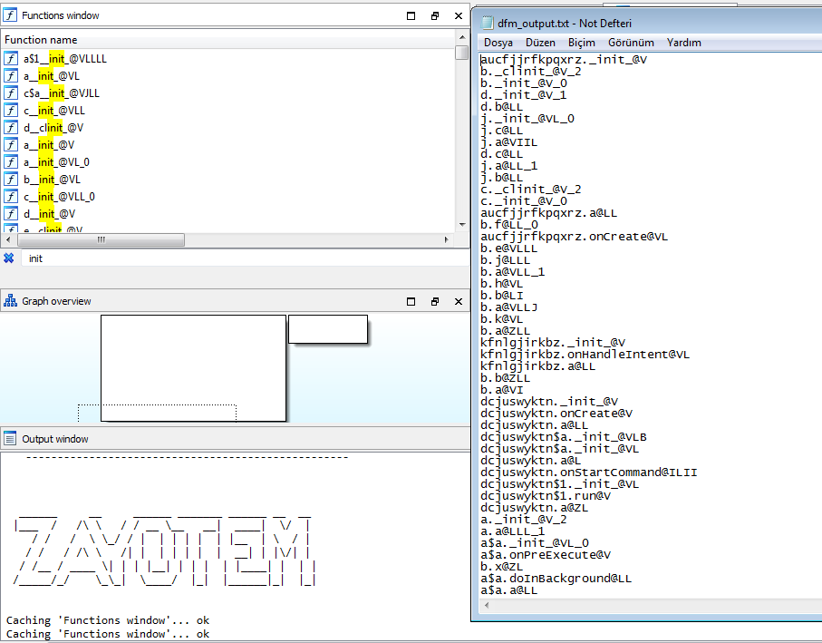

# DFMAndroid
[EN]

IDA script of Dynamic Function Mapper for Android 

Requirement: IDA PRO, an Android emulator (like Genymotion)

Usage:

Load APK to IDA and Android emulator. Set dalvik debugger options under below Debugger->Debugger Options->Set Spesific Options. To load script, Go File->Script File and select the script file or you can use ALT+F7 shortcut. Script will add breakpoint to all functions. When the breakpoint is triggered (IDA dalvik debugger must be working), script will save function names in order of execution to dfm_output.txt which is located in your desktop.

[TR] 

Android için Dinamik Fonksiyon Haritalayan IDA scripti

Gereklilikler: IDA PRO, herhangi bir Android emülatör (Genymotion gibi)

Kullanım:

APK'yı hem IDA'ya hem de Android emülatöre yükleyin. Dalvik debugger ayarlarını yapmak için Debugger->Debugger Options->Set Spesific Options sekmesini kullanın. Scripti yüklemek için, Go File->Script File sekmesini ya da ALT+F7 kısayolunu kullanabilirsiniz. Script tüm fonksiyonlara breakpoint ekleyecektir. Daha sonra breakpoint tetiklendiğinde (yani debugger çalıştığında), script tüm fonksiyon isimlerini çalışma sırasına göre masaüstünde dfm_output.txt'ye kaydedecektir. 

## Developers
Halil FİLİK
Hakan SOYSAL

